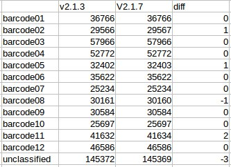
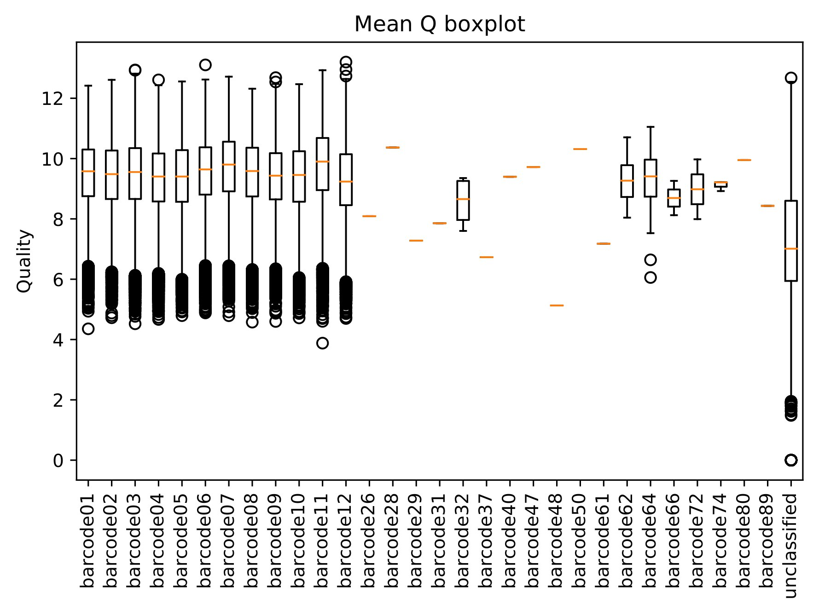
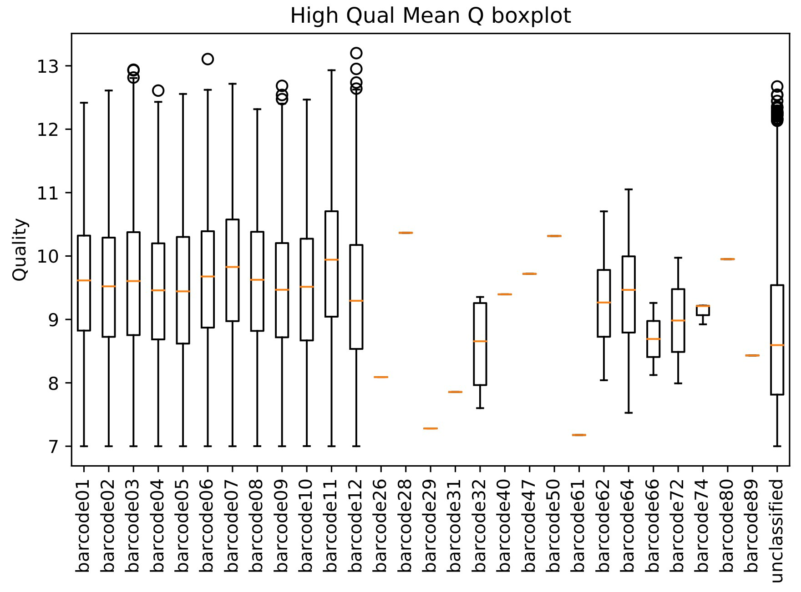
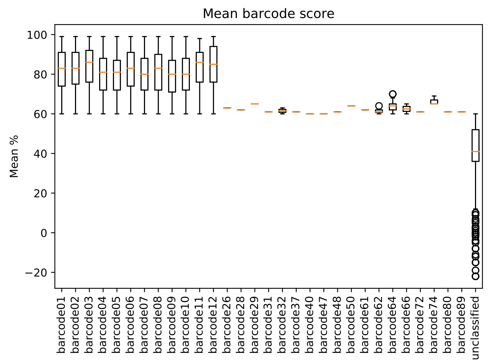
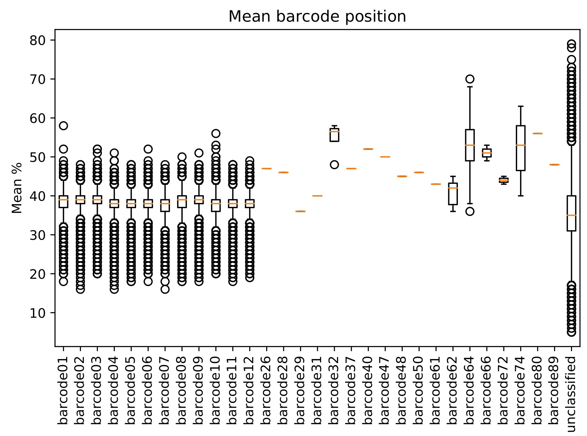

# Barcoding with ONT

With the recent release of Albacore_2.1.7, I ran it on my barcoded data and compared it to v2.1.3

Here are some quick and dirty stats...

First up I didn't really get much of a difference....
This may be be because I wasn't affected by the bug. It had already recovered ~70% of the total reads.

I also got some interesting results running LSK108 kit --barcoding where it picked up some other barcodes. Here is the unfiltered quality scores of the barcodes

And if we filter that by Q >= 7

And here is the % match of the barcodes (taking the best match)

And for a little overkill, here are the average positions of each barcode

It's only ~50 reads that got classified out of the 12 NB barcodes, so I can just filter them out, but figured it was worth mentioning. 

So ultimately, I don't think the data was impacted by the bug in v2.1.3, however I am intrigued by the off target barcodes.

I'll run Porechop and shee what it thinks, but I have a hunch that it will lock onto the 12 barcodes and run with it.

I'll update when I have that data.
